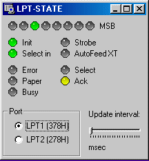



## LPT\-State

### Description

This nice-looking small application monitors LTP ports states and shows them in LED style panel. If you want to see, what's going through your port when printing or you need to fix some problems with LPT-ports, this is the right tool for that.
 
### More Info
 
Fully editable source code!

Theres only one side effect: You will feel quilty until you vote for me ;)

             |
---                |---
**Submitted On**   |2001-01-06 21:20:56
**By**             |[Sami Riihilahti](https://github.com/Planet-Source-Code/PSCIndex/blob/master/ByAuthor/sami-riihilahti.md)
**Level**          |Advanced
**User Rating**    |4.6 (41 globes from 9 users)
**Compatibility**  |VB 5\.0, VB 6\.0
**Category**       |[Complete Applications](https://github.com/Planet-Source-Code/PSCIndex/blob/master/ByCategory/complete-applications__1-27.md)
**World**          |[Visual Basic](https://github.com/Planet-Source-Code/PSCIndex/blob/master/ByWorld/visual-basic.md)
**Archive File**   |[CODE\_UPLOAD13455162001\.zip](https://github.com/Planet-Source-Code/sami-riihilahti-lpt-state__1-14194/archive/master.zip)

